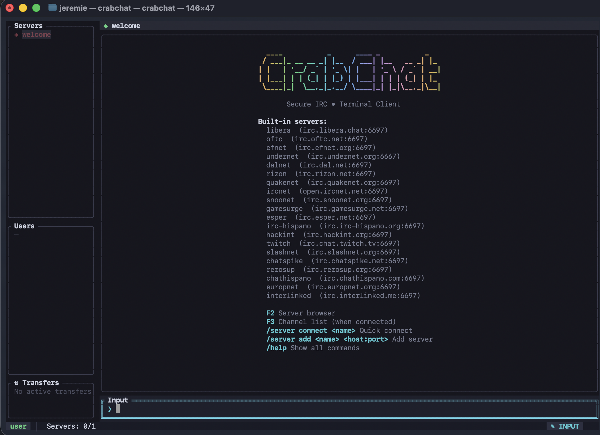
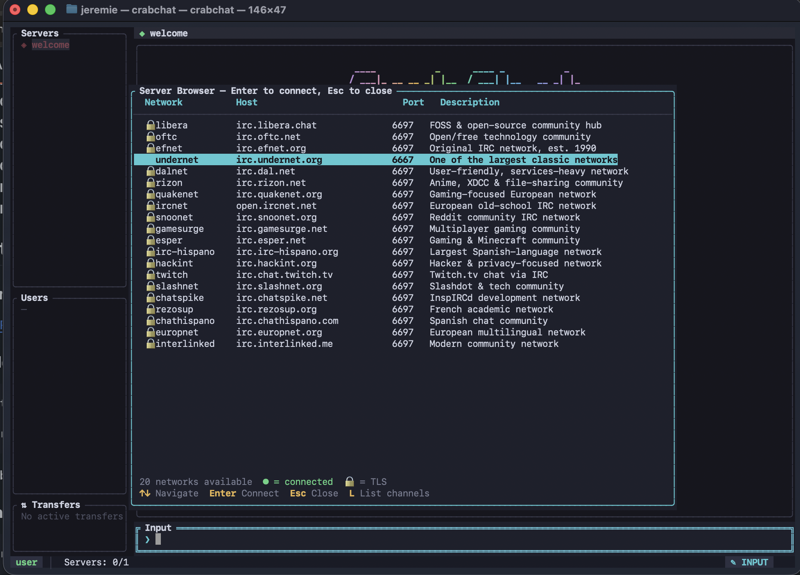

# CrabChat

A secure IRC client with a modern terminal UI, built in Rust.

CrabChat provides a full-featured IRC experience in the terminal with TLS support, DCC file transfers, mIRC color rendering, and a responsive multi-panel interface.

## Screenshots

| Welcome Screen | Server Browser | Channel Browser |
|:-:|:-:|:-:|
|  |  |  |

## Features

- **Multi-server** — Connect to multiple IRC networks simultaneously
- **TLS encryption** — Secure connections with TLS (including SASL authentication)
- **Modern TUI** — Responsive layout with server tree, message area, user list, and status panels
- **DCC file transfers** — Receive files with security protections (path traversal prevention, IP validation, size limits)
- **mIRC colors** — Full rendering of mIRC color codes and formatting
- **Channel browser** — Search and filter the server's channel list (F3)
- **Server browser** — Quick-connect to 20 built-in IRC networks (F2)
- **Chat logging** — Optional per-channel/query daily log files
- **CTCP support** — Configurable replies to VERSION, PING, TIME, and FINGER
- **Nick management** — Random nick generation, alt-nick fallback, NickServ auto-identify
- **Ignore & notify lists** — Per-session ignore and online notification tracking

## Installation

### Prerequisites

- [Rust](https://rustup.rs/) 1.70+ (2021 edition)

### Build from source

```bash
git clone <repository-url>
cd ircchat
cargo build --release
```

The binary will be at `./target/release/crabchat`.

### Run directly

```bash
cargo run --release
```

## Quick Start

1. **Launch CrabChat:**
   ```bash
   cargo run --release
   ```

2. **Browse servers** — Press `F2` or type `/servers` to open the server browser

3. **Connect** — Select a server and press Enter, or use:
   ```
   /server connect libera
   ```

4. **Join a channel:**
   ```
   /join #crabchat
   ```

5. **Start chatting!** Type your message and press Enter.

## Keyboard Shortcuts

| Key | Action |
|-----|--------|
| `Enter` | Send message / submit command |
| `Tab` | Cycle focus: Input → Server Tree → Messages → User List |
| `Ctrl+N` / `Ctrl+P` | Next / previous buffer |
| `PageUp` / `PageDown` | Scroll messages |
| `Up` / `Down` | Command history (in input) / navigate (in panels) |
| `Ctrl+A` / `Home` | Move cursor to start of input |
| `Ctrl+E` / `End` | Move cursor to end of input |
| `Ctrl+U` | Clear input line |
| `Alt+Backspace` | Delete word backward |
| `F2` | Toggle server browser |
| `F3` | Toggle channel browser |
| `Ctrl+C` / `Esc` | Close modal / quit |

## Commands

### Server Management

| Command | Description |
|---------|-------------|
| `/server add <name> <host:port>` | Add a custom server (use `host:+port` for explicit TLS) |
| `/server connect <name>` | Connect to a named server |
| `/server list` | List configured servers |
| `/server disconnect` | Disconnect from current server |
| `/servers` | Open server browser (F2) |

### Channels

| Command | Description |
|---------|-------------|
| `/join <channel>` | Join a channel (auto-prepends `#` if missing) |
| `/part [channel] [reason]` | Leave a channel |
| `/channels` | Open channel browser (F3) |
| `/topic <text>` | Set the channel topic |
| `/list` | Request channel list from server |

### Messaging

| Command | Description |
|---------|-------------|
| `/msg <target> <text>` | Send a private message |
| `/me <text>` | Send an action (CTCP ACTION) |
| `/notice <target> <text>` | Send a NOTICE |
| `/slap <nick>` | Slap someone with a trout |
| `/ctcp <target> [command]` | Send a CTCP request (default: VERSION) |

### User Management

| Command | Description |
|---------|-------------|
| `/nick <nick>` | Change your nickname |
| `/whois <nick>` | Look up user information |
| `/who <target>` | Query users matching a pattern |
| `/away [message]` | Set/clear away status |
| `/ignore <nick>` | Ignore messages from a user |
| `/unignore <nick>` | Stop ignoring a user |
| `/ignorelist` | Show ignored nicks |
| `/notify [nick]` | Toggle online notification for a nick / show list |

### Channel Operator

| Command | Description |
|---------|-------------|
| `/kick [channel] <user> [reason]` | Kick a user |
| `/ban [channel] <mask>` | Ban a user/mask |
| `/op [channel] <nick>` | Give operator status |
| `/deop [channel] <nick>` | Remove operator status |
| `/voice [channel] <nick>` | Give voice |
| `/devoice [channel] <nick>` | Remove voice |
| `/mode <target> <modes>` | Set channel/user modes |

### DCC File Transfers

| Command | Description |
|---------|-------------|
| `/dcc list` | List all transfers |
| `/dcc accept <id>` | Accept a pending transfer |
| `/dcc cancel <id>` | Cancel a transfer |

### Other

| Command | Description |
|---------|-------------|
| `/raw <command>` | Send a raw IRC command |
| `/quit [message]` | Quit CrabChat |
| `/help` | Show help |

## Configuration

Configuration is stored at `~/.config/crabchat/config.toml`. Copy `config.example.toml` to get started:

```bash
mkdir -p ~/.config/crabchat
cp config.example.toml ~/.config/crabchat/config.toml
```

If no config file exists, CrabChat uses defaults with 20 built-in server presets and a randomly generated nickname.

### Configuration Reference

```toml
# ── Server Connections ─────────────────────────────────────────────
# Define one or more [[servers]] blocks.

[[servers]]
name = "libera"                    # Display name
host = "irc.libera.chat"          # Server hostname
port = 6697                        # Port (default: 6697)
tls = true                         # Use TLS (default: true)
nickname = "myname"                # IRC nickname
username = "myuser"                # Optional: IRC username (ident)
realname = "My Name"               # Optional: real name field
password = ""                      # Optional: server password
nick_password = "secret"           # Optional: NickServ password (auto-identify)
sasl_mechanism = "PLAIN"           # Optional: SASL mechanism
channels = ["#crabchat", "#rust"]  # Channels to auto-join
auto_connect = false               # Connect on startup (default: false)
alt_nicks = ["myname_", "myname__"]# Fallback nicks if primary is taken
quit_message = "Bye!"              # Custom quit message
part_message = "Leaving"           # Custom part message
accept_invalid_certs = false       # Accept self-signed TLS certs (default: true)

# ── UI Settings ────────────────────────────────────────────────────

[ui]
timestamp_format = "%H:%M"        # strftime format (default: "%H:%M")
max_scrollback = 10000             # Max messages per buffer (default: 10000)
parse_mirc_colors = true           # Render mIRC color codes (default: true)
highlight_urls = true              # Underline URLs (default: true)

# ── DCC File Transfer Settings ─────────────────────────────────────

[dcc]
download_dir = "./downloads"       # Download directory (default: "./downloads")
max_file_size = 524288000          # Max file size in bytes (default: 500 MB)
reject_private_ips = false         # Block DCC from LAN/private IPs
auto_accept = false                # Auto-accept incoming DCC transfers

# ── Behavior Settings ──────────────────────────────────────────────

[behavior]
auto_rejoin_on_kick = false        # Auto-rejoin channels after kick
rejoin_delay_secs = 3              # Delay before rejoining (default: 3)
bell_on_mention = false            # Terminal bell on nick mention
bell_on_pm = false                 # Terminal bell on private message
quit_message = "CrabChat"          # Default quit message
part_message = "Leaving"           # Default part message

# ── Chat Logging ───────────────────────────────────────────────────

[logging]
enabled = false                    # Enable chat logging (default: false)
log_dir = "~/.local/share/crabchat/logs"  # Log directory
log_channels = true                # Log channel messages (default: true)
log_queries = false                # Log private messages (default: false)

# ── CTCP Settings ──────────────────────────────────────────────────

[ctcp]
reply_version = true               # Reply to VERSION requests (default: true)
reply_ping = true                  # Reply to PING requests (default: true)
reply_time = true                  # Reply to TIME requests (default: true)
reply_finger = false               # Reply to FINGER requests (default: false)
version_string = "CrabChat - Rust IRC Client"
finger_string = "CrabChat user"
```

## Built-in Server Presets

CrabChat ships with 20 pre-configured IRC networks:

| Name | Host | TLS |
|------|------|-----|
| libera | irc.libera.chat | Yes |
| oftc | irc.oftc.net | Yes |
| efnet | irc.efnet.org | Yes |
| undernet | irc.undernet.org | No |
| dalnet | irc.dal.net | Yes |
| rizon | irc.rizon.net | Yes |
| quakenet | irc.quakenet.org | Yes |
| ircnet | open.ircnet.net | Yes |
| snoonet | irc.snoonet.org | Yes |
| gamesurge | irc.gamesurge.net | Yes |
| esper | irc.esper.net | Yes |
| irc-hispano | irc.irc-hispano.org | Yes |
| hackint | irc.hackint.org | Yes |
| twitch | irc.chat.twitch.tv | Yes |
| slashnet | irc.slashnet.org | Yes |
| chatspike | irc.chatspike.net | Yes |
| rezosup | irc.rezosup.org | Yes |
| chathispano | irc.chathispano.com | Yes |
| europnet | irc.europnet.org | Yes |
| interlinked | irc.interlinked.me | Yes |

## Troubleshooting

### Connection fails with TLS error

Some servers have strict TLS requirements. Try:
- Setting `accept_invalid_certs = true` in your server config
- Verify the server hostname and port are correct
- Ensure port 6697 (TLS) or 6667 (plaintext) is not blocked by your firewall

### Nickname already in use

CrabChat will automatically try alternative nicknames if configured:
```toml
alt_nicks = ["myname_", "myname__"]
```

If no alt_nicks are set, CrabChat appends `_` to the current nick.

### DCC transfers fail

- Ensure the download directory exists and is writable
- Check that `max_file_size` is large enough for the file
- If the sender is on a LAN, set `reject_private_ips = false`
- The sender must allow inbound TCP connections on the advertised port

### No colors in the terminal

- Ensure your terminal supports 24-bit (true color) RGB
- Terminals that work well: iTerm2, Alacritty, WezTerm, Kitty, Windows Terminal
- If colors look wrong, check your `TERM` environment variable (should be `xterm-256color` or similar)

### Chat logs not appearing

- Set `enabled = true` under `[logging]`
- Verify the `log_dir` path is writable
- Channel logging requires `log_channels = true`; private message logging requires `log_queries = true`

## License

MIT
